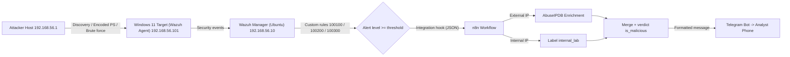

# Lab Architecture

1. Attacker melakukan discovery, encoded PowerShell, atau brute force ke target Windows.
2. Wazuh agent meneruskan event ke Wazuh manager.
3. Custom rules memicu alert severity tinggi.
4. Alert dikirim lewat integration hook ke webhook n8n.
5. n8n memperkaya IP eksternal via AbuseIPDB dan melabeli IP internal otomatis.
6. Hasil digabung jadi satu verdict dan alert bersih dikirim ke Telegram.
